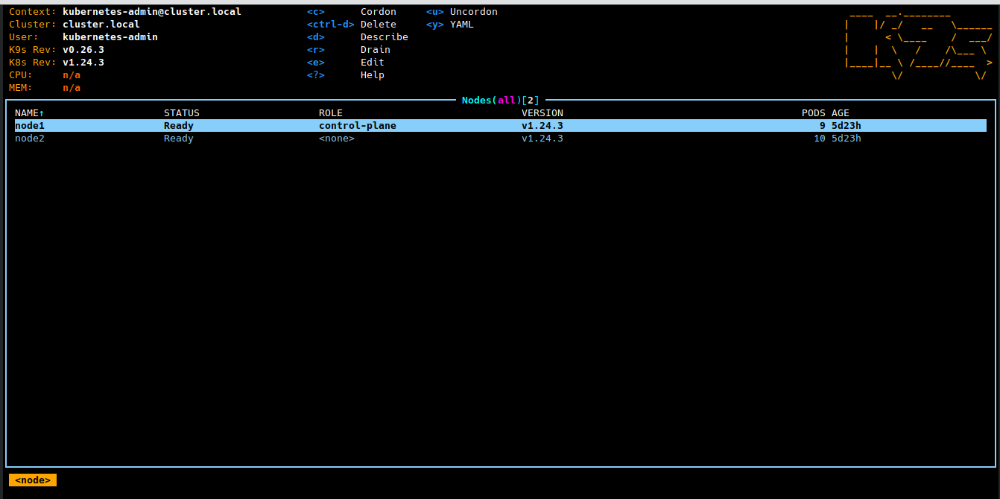
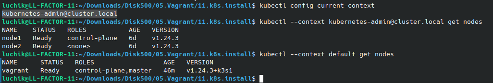

# My 11.K8s.Install

## Create Alias
```bash
echo "alias ka='kubectl apply -f'" >>~/.bashrc
```

## My Config File for K8s it-academy and K3s local host in vagrant
```bash
apiVersion: v1
clusters:
- cluster:
    certificate-authority-data: LS0tLS1CRUdJTiBDRVJUSUZJQ0FURS0tLS0tCk1JSUMvakNDQWVhZ0F3SUJBZ0lCQURBTkJna3Foa2lHOXcwQkFRc0ZBREFWTVJNd0VRWURWUVFERXdwcmRXSmwKY201bGRHVnpNQjRYRFRJeU1EZ3hPREl3TWpNMU1Wb1hEVE15TURneE5USXdNak0xTVZvd0ZURVRNQkVHQTFVRQpBeE1LYTNWaVpYSnVaWFJsY3pDQ0FTSXdEUVlKS29aSWh2Y05BUUVCQlFBRGdnRVBBRENDQVFvQ2dnRUJBTlQ5CnhOdlNLakNNaVVGV1BLWUY2MFh2SDNBL3l2VmNsa1lQNk9SL0ViV0xIN3p4K1lGTGUwTUhmYk1rS3N6QmRxSFQKYWR1dWM5UHRsU0doemN2eHZIWlN4WWpSK0tQMnhJU1pFMkVEK01pM0pVWEgySkJ1cUdjUnA4YVNsRzltSWhZYwpVTVo3Z2hRU05mSnFkRmk0MlYxUFFGSW9QQjdaZlRKZUhmK0o5ekkyc25jWUN4VzRrWSsxaVNmTXRHckZyRXh5CmJrMUNvRlZBL3JYMmFWMEtWdWQ1UTU4eW56ZjVYZmVmS1B6V2V5LzdwUkd6OHBBZ3ZPeFlZSXBqalJUWXVwUW4KWmdZQ0ozcVd1OHpQZ2VIcjVTZ0JRVTEzVjluRHl2Y0p0MGpZNDF1Zy9CS3lXMFl3dTRFNDlEZXloL3JoU2tWSApsSWp4VTE2UnJ0UUJiK0x3QXZzQ0F3RUFBYU5aTUZjd0RnWURWUjBQQVFIL0JBUURBZ0trTUE4R0ExVWRFd0VCCi93UUZNQU1CQWY4d0hRWURWUjBPQkJZRUZBOEtzSTdNWEp3WnlYb3hBUklKNVN1VW8vb0RNQlVHQTFVZEVRUU8KTUF5Q0NtdDFZbVZ5Ym1WMFpYTXdEUVlKS29aSWh2Y05BUUVMQlFBRGdnRUJBQWVEdjZkZHNxSDZaay9VbUsxcApzOVBjMTRoNjVxMlFHMmZWWW4rZEZRenIwUm9vK0M1Z3ZCVzJueEF5bnFCd3h3bmFjZlVvZ3hMRkd1Qjg2U0orCi9aTnhYWSt3N2pCZ0Z1eTIrZ28yT2NUbExOaHpQUnJ4a0sySlhEU0R0c2pCek92a2V4bFpMcXkxcFlmU2pIOWIKWll1SGxVRGFvbWlPc0lSc1dvcng0a1BCRGU1eVpHZUtaZ3krRkF6RWJWZDZHUVdMVXUySXI3WUZFQ1NTOVdwcApXY2RuNXUrNGRxN3pGWlBiemdyaDk4eHNML1NYaUdpNUxCZEptMGNzS2ZSdW5ZYmlQYUhuLytaYjhLTTdXRWxQCm1PUXBWWmt4WURuY3UvT0VpSkRKcDZvcFQxWDhqVWU3ZTg1eDQ0czFCYkYrQkdHbVA4N3ZZYnFGVEJtUHhxTkMKNXAwPQotLS0tLUVORCBDRVJUSUZJQ0FURS0tLS0tCg==
    server: https://127.0.0.1:6443
  name: cluster.local
- cluster:
    certificate-authority-data: LS0tLS1CRUdJTiBDRVJUSUZJQ0FURS0tLS0tCk1JSUJkekNDQVIyZ0F3SUJBZ0lCQURBS0JnZ3Foa2pPUFFRREFqQWpNU0V3SHdZRFZRUUREQmhyTTNNdGMyVnkKZG1WeUxXTmhRREUyTmpFek56STBOemN3SGhjTk1qSXdPREkwTWpBeU1URTNXaGNOTXpJd09ESXhNakF5TVRFMwpXakFqTVNFd0h3WURWUVFEREJock0zTXRjMlZ5ZG1WeUxXTmhRREUyTmpFek56STBOemN3V1RBVEJnY3Foa2pPClBRSUJCZ2dxaGtqT1BRTUJCd05DQUFSMTFJMnBBazEyVXJEdzhUR0cwTStVNk9UaHBDOEpKRU44Sy9SbCtiTE8KRHdMTUxLb1g2SWxUdEk5YmNlOWdHRE8velhZQ21IaXgrdE41T2NGL1NzZUtvMEl3UURBT0JnTlZIUThCQWY4RQpCQU1DQXFRd0R3WURWUjBUQVFIL0JBVXdBd0VCL3pBZEJnTlZIUTRFRmdRVVh5Y2RWQldtaC9rWkE3Q0p1T3dLCnZ0cHNEclV3Q2dZSUtvWkl6ajBFQXdJRFNBQXdSUUloQU8rckJZQTlTVmkrZUFoOGJrNW9NN3ZmOHNldk8xU2YKaUlrT3hyYm1qVVE1QWlCUmIvOVV3R1ZDNXEzYnJqM3F2R1NoTmxXaEFuUFVxQko1ZlFLUCtEbUROdz09Ci0tLS0tRU5EIENFUlRJRklDQVRFLS0tLS0K
    server: https://127.0.0.1:6444
  name: default
contexts:
- context:
    cluster: cluster.local
    user: kubernetes-admin
  name: kubernetes-admin@cluster.local
- context:
    cluster: default
    user: default
  name: default
current-context: kubernetes-admin@cluster.local
kind: Config
preferences: {}
users:
- name: kubernetes-admin
  user:
    client-certificate-data: LS0tLS1CRUdJTiBDRVJUSUZJQ0FURS0tLS0tCk1JSURJVENDQWdtZ0F3SUJBZ0lJTitweHplQkpFN3N3RFFZSktvWklodmNOQVFFTEJRQXdGVEVUTUJFR0ExVUUKQXhNS2EzVmlaWEp1WlhSbGN6QWVGdzB5TWpBNE1UZ3lNREl6TlRGYUZ3MHlNekE0TVRneU1ESXpOVEphTURReApGekFWQmdOVkJBb1REbk41YzNSbGJUcHRZWE4wWlhKek1Sa3dGd1lEVlFRREV4QnJkV0psY201bGRHVnpMV0ZrCmJXbHVNSUlCSWpBTkJna3Foa2lHOXcwQkFRRUZBQU9DQVE4QU1JSUJDZ0tDQVFFQXlCNzh0bXcwd3FBeG5aWDUKQmpnWk40Z2NyVGxpdEYycUFKcmhRVTVMTWZaVEpTN0NFRWMzMkZNL3hvY2k0LytORWMwUGJFMURqbXJwNm43egpJUmRUMDZ0L1J5dTZBQVVKUjBocFl2MkZEVVhzdFovU0JGM0thanQ4NXRUZEtjMUY4T24xNzBkRUpNd2p5L09BCldPRGpMeTJPbmxjb1NDSFdqMUwwUEJsWTB3N2NyS0d6bG1pS0lnajI0dDF6Uk5RV3pvM0NwUFRzK0k4UUdXUDIKQWY4cDJ3cFBTYk5POTZxcTlQK2lYanNwSGd0NmFwbHMyUFdtVFo3S2xyTS9WZ1Z5QWM5UnVxMEd3Qm1hUmd4Qgo2RUY2RVluenFxSkNUTG9Db1pYK0xYTFZGc2JGSVlQa1BJaFpwV0s1cCtqNi9lS0JGYVdPWEJvZkVvTHkxd0hHCms1dFNxd0lEQVFBQm8xWXdWREFPQmdOVkhROEJBZjhFQkFNQ0JhQXdFd1lEVlIwbEJBd3dDZ1lJS3dZQkJRVUgKQXdJd0RBWURWUjBUQVFIL0JBSXdBREFmQmdOVkhTTUVHREFXZ0JRUENyQ096RnljR2NsNk1RRVNDZVVybEtQNgpBekFOQmdrcWhraUc5dzBCQVFzRkFBT0NBUUVBd0ZFbzdwaktSUVY2YjE1OHR3MTdJUmI4M1JPMUlCNTNTRXp3CkVPMmNmalR3SFR1eDZYeDB5amxnQ2dZby9TSUIwQjAzdjdOQW56L0pyZm5TYzZ3OEZweXVZd012ZzNNbjA4RmQKMVVpYXE5bmkwSSt6RnpVRUZHb2lHUkM4TlBZaU5lb21uV3ZCaUNTbERxU1BqWURyRWJTVkl0dys0TTQyenlWNApCaGVqdzF5cmJFaThYclpVWmdBdlZ6d3J2QTB2YjZObDlnWVpUMU9ydzl0bGY2akZaSXcvRTlQQ0kvSWROMlpiCkhSamFZUnlzbVUyTlFwZlpxVnFjL29QWEJLdGlLZ1VYZkxKeFpFZks4NEEvRkhKQWZmcTlRZ1hMMFJ3by9VRWcKT3g1eVdiRGM1R04wdHNta2N4LzdyUHZmKzFnc0U2OXFSNElweEg5eStzaGxaamdJaFE9PQotLS0tLUVORCBDRVJUSUZJQ0FURS0tLS0tCg==
    client-key-data: LS0tLS1CRUdJTiBSU0EgUFJJVkFURSBLRVktLS0tLQpNSUlFb3dJQkFBS0NBUUVBeUI3OHRtdzB3cUF4blpYNUJqZ1pONGdjclRsaXRGMnFBSnJoUVU1TE1mWlRKUzdDCkVFYzMyRk0veG9jaTQvK05FYzBQYkUxRGptcnA2bjd6SVJkVDA2dC9SeXU2QUFVSlIwaHBZdjJGRFVYc3RaL1MKQkYzS2FqdDg1dFRkS2MxRjhPbjE3MGRFSk13ankvT0FXT0RqTHkyT25sY29TQ0hXajFMMFBCbFkwdzdjcktHegpsbWlLSWdqMjR0MXpSTlFXem8zQ3BQVHMrSThRR1dQMkFmOHAyd3BQU2JOTzk2cXE5UCtpWGpzcEhndDZhcGxzCjJQV21UWjdLbHJNL1ZnVnlBYzlSdXEwR3dCbWFSZ3hCNkVGNkVZbnpxcUpDVExvQ29aWCtMWExWRnNiRklZUGsKUEloWnBXSzVwK2o2L2VLQkZhV09YQm9mRW9MeTF3SEdrNXRTcXdJREFRQUJBb0lCQUYveFd6OHFTWEUxMUJPMQpIeHE0TW43Skp0WjF1TGk0WHhURExGTmU4ZllXSG02cEtDa2R1OHhldlNpMUNTaytENmdGSSt2TWJ5TU1adkVoCncvYU5kSWI2cFo2OWZBTWVad0JoMndTMmZ0K0tNcDR3N1VOaW8vU2lhSk5TWW1YMElDQU1TdmhZdG5iZDJCdWoKdGxqbUdJVTUxakpibnRoV1FNT2VCYkg2aFBkS1F6Z0Nkcy9YMjg3dnl3c0h4d1Rrbm9mb3ZKbDl6ZEhqdW4yNApHTWRFQ1dNTCt3OWVqWXZkOEFkaHZKSWd1S0puMERlSlJlbXdaYTMwWThUM1RoNzNCZGRKUTFQcitBeE0rbFJ3CkM3enJlcWRXOWYxZmtINVZVaXRQVWNsUlZXK0wrdzFZSzcxcG51U2VCekc0VXFNb3ZlUDFMY0M3WEVTNCtTMmkKc0tmd1Z3RUNnWUVBMHZEODNrSDB0WVNOYWk1SjM5bHYxcHhOQjZaa3p0OGNRdmlxTXRHZEdyd0ZEZHF6V1dMYQpnK3g1RkpOVWlOZUMvdDNxREFqZURwZW9sTkM3RXFSczczNWJFa2tPWDRYNGJIZStGaXdpL1NSdEJvTStDSmhlCnVGMS9JNUxjZm56ZVAzWlZpRld6ZU1pZGFNd1EvMENROU1scEs4Zkl5ZmY1V1JFenVkVVNYS0VDZ1lFQTh0NU8KZ3BpTGw0ek1wdHBMSklJRE0wazhPcEdnRDE3enFXM2hISmNxNEsvWHJUZGpEMmZ3blJsRFNYdks3eDZiR21ibQplaTFJWXRSYUhuNFU5YW1CQVY3TC9ra016MkJxVXRtWVVESXJSRnUreXlpM0RrYzZadWgyOUhuR2pOTXc4enBUClorSFZoeGJmVzN4Q1V1eUQwN0xHR1haODlwY0dIVUZDY2ZNWWY4c0NnWUFjUG1ZdFFEbUt3R2ZLNnMyN2FqcSsKU29sSjErNnhnRkFoYTNnbWU4aUVWdDU2WDJrYU05RThUc0piamVxSXRBcDNJN0Y5MFFZaWdBM3pkd3RGVUx6QgpTSExiUE9ydXdWcGs4NWVCRW9IUTBUckQzM2pEMzlyMjVwWHFablNkZnd5bkJLb3BLZ2h3eUxQQzMyZjdOV0x6ClU3Q0FTeXpJVmlxTjBXN1NtQVB3WVFLQmdDQVhxQ0F4c0NCeWhvaDF5QUFtL2UxRS9DUnhJY2xtTHFSdzFKSkcKbDIvaFRJcWpDdi82S0IxYVBUMzBrYmhQUHdlYUdWS0RzVkQ5NW5xcEJuUC8xZ0FzV3FCYlhzbjRYNVJiRkhsawpaN3M4dEZWOEo5UkhMVHh6ODJRU3cxM1FlbU5wamFQb2Y2SytMdjJUeWQvVFNRZ3NVMmtCOHpsU2M0aGlHem1iCmVkMUpBb0dCQUlTWmg3OE81cTVZcklxaUNicDZzb0lCYkxQUm9zMGNvMDI5MmVuVDA3V1B2K3B0OGV2eFRlZTMKcFBMZCtmZHc3b1p1SVR0UXpWb0RxcW5Eb04rbVdxVmttY1kwRFFyYmg2RUNxMjVDeHV1K2Z4TVFydXpEVFo2agpYK0U2NHNWekxmTTc0M2RJbFFBS1B4Qys0NmtlaTNxRGRiaFBJZEZ1R3RDbUZsM1RzdHQ1Ci0tLS0tRU5EIFJTQSBQUklWQVRFIEtFWS0tLS0tCg==
- name: default
  user:
    client-certificate-data: LS0tLS1CRUdJTiBDRVJUSUZJQ0FURS0tLS0tCk1JSUJrVENDQVRlZ0F3SUJBZ0lJU2VabUR0TmVuQ0F3Q2dZSUtvWkl6ajBFQXdJd0l6RWhNQjhHQTFVRUF3d1kKYXpOekxXTnNhV1Z1ZEMxallVQXhOall4TXpjeU5EYzNNQjRYRFRJeU1EZ3lOREl3TWpFeE4xb1hEVEl6TURneQpOREl3TWpFeE4xb3dNREVYTUJVR0ExVUVDaE1PYzNsemRHVnRPbTFoYzNSbGNuTXhGVEFUQmdOVkJBTVRESE41CmMzUmxiVHBoWkcxcGJqQlpNQk1HQnlxR1NNNDlBZ0VHQ0NxR1NNNDlBd0VIQTBJQUJMTFovQ0luSXpXSThaZisKMittZWJPQWlhcE4wZDdHWGoxaXdDeW9QV1IwQmpUQzhOdFVSUVpaajhYZGE4MjFwR1hJaFRmeW1od3NkcVF4eApLR0d0SU91alNEQkdNQTRHQTFVZER3RUIvd1FFQXdJRm9EQVRCZ05WSFNVRUREQUtCZ2dyQmdFRkJRY0RBakFmCkJnTlZIU01FR0RBV2dCUlFrUDVpandXdjZqOTVrTUN5R2VFNzRQdGtTekFLQmdncWhrak9QUVFEQWdOSUFEQkYKQWlBcjVVbG44L2Y3c01jalFzT3dSU2JjYXBZeFFMaFFGYmQzeGVMbDZ2L1RvUUloQU5ubUMvVElMeFZKeE1iSgpEZzZzNHdhTTIyaW1Rc1RSTjlrenFqWmphV3BuCi0tLS0tRU5EIENFUlRJRklDQVRFLS0tLS0KLS0tLS1CRUdJTiBDRVJUSUZJQ0FURS0tLS0tCk1JSUJkakNDQVIyZ0F3SUJBZ0lCQURBS0JnZ3Foa2pPUFFRREFqQWpNU0V3SHdZRFZRUUREQmhyTTNNdFkyeHAKWlc1MExXTmhRREUyTmpFek56STBOemN3SGhjTk1qSXdPREkwTWpBeU1URTNXaGNOTXpJd09ESXhNakF5TVRFMwpXakFqTVNFd0h3WURWUVFEREJock0zTXRZMnhwWlc1MExXTmhRREUyTmpFek56STBOemN3V1RBVEJnY3Foa2pPClBRSUJCZ2dxaGtqT1BRTUJCd05DQUFSdUprV0M2aEI2OVl2VlJlRTJERjdERmNxeGhiZEFpVlVUYzRPYitENnMKcG0vQ3ZtVittRFFFczZId1duVG10UVdUK1g3RTRjZ3pPbGE4U01NNWtQcFNvMEl3UURBT0JnTlZIUThCQWY4RQpCQU1DQXFRd0R3WURWUjBUQVFIL0JBVXdBd0VCL3pBZEJnTlZIUTRFRmdRVVVKRCtZbzhGcitvL2VaREFzaG5oCk8rRDdaRXN3Q2dZSUtvWkl6ajBFQXdJRFJ3QXdSQUlnR1lWTWJJNVN5U2JaaXpDUXJvTlBTVW5ENTM1MmFhdkkKbVRwTW9UQ3BZMTBDSUJCSDd0OXlWbHB0VXBJZWNha2V6dzdneGFHbUI5ekFMVkRqL1I1dkU5TXcKLS0tLS1FTkQgQ0VSVElGSUNBVEUtLS0tLQo=
    client-key-data: LS0tLS1CRUdJTiBFQyBQUklWQVRFIEtFWS0tLS0tCk1IY0NBUUVFSUZPcmhac0Frb1Y4VXUwNmNYakx0cUpJczV4Z3h3NEVlYm93UDVFV3FSWVpvQW9HQ0NxR1NNNDkKQXdFSG9VUURRZ0FFc3RuOElpY2pOWWp4bC83YjZaNXM0Q0pxazNSM3NaZVBXTEFMS2c5WkhRR05NTHcyMVJGQgpsbVB4ZDFyemJXa1pjaUZOL0thSEN4MnBESEVvWWEwZzZ3PT0KLS0tLS1FTkQgRUMgUFJJVkFURSBLRVktLS0tLQo=

```

## Screenshot K9s


## Screenshot kubectl --context

