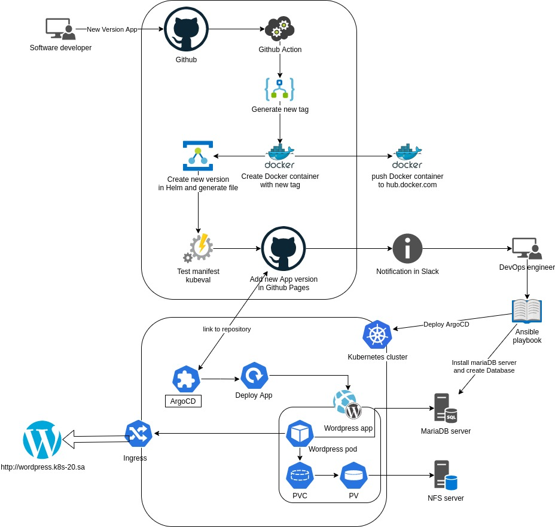

# Project report

#### Project's reporter: Andrei Luchanok
#### Group number: md-sa2-21-22
---
### Description of application for deployment
Application: Wordpress \
Programimg language: PHP \
DB: MariaDB
---
### Official git repository link: https://github.com/nextcloud/docker 
---
## Pipeline. High Level Design

---
## Technologies which were used in project
- **Orchestration:** Kubernetes
- **Automation tools:** Github actions, ArgoCD, Ansible
- **SCM:** GitHub
- **Notification:** Slack
- **Other tools:** Docker, Helm, Argo Rollouts
---

## Links: 
Project repository: https://github.com/Luchik51/wordpress-academy \
Helm carts repository: https://luchik51.github.io/wordpress-academy/ \
Docker repository: https://hub.docker.com/r/luchik/project2022 \
Official git repository link: https://github.com/WordPress/WordPress
